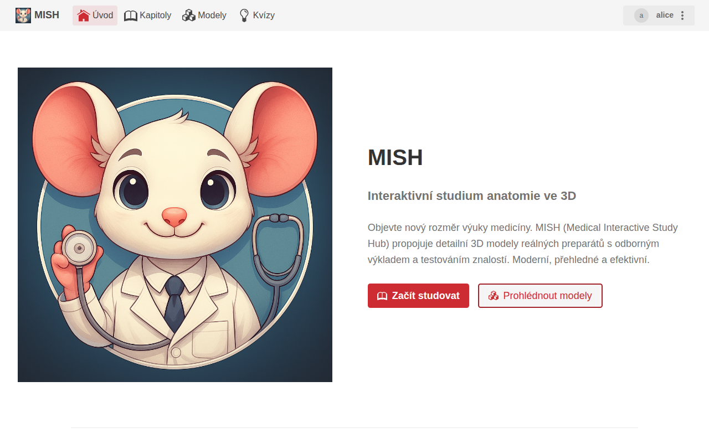
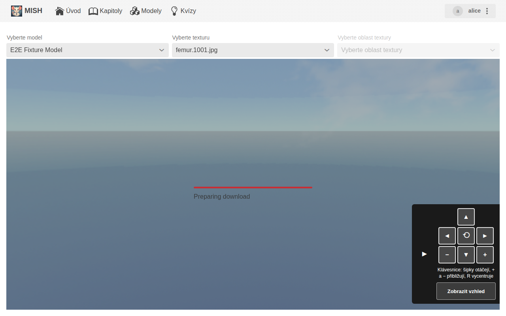
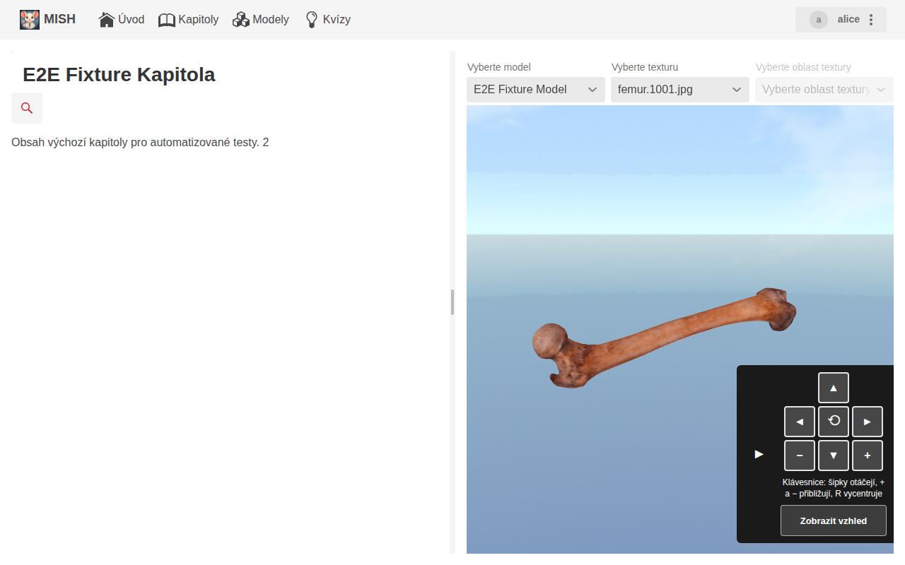
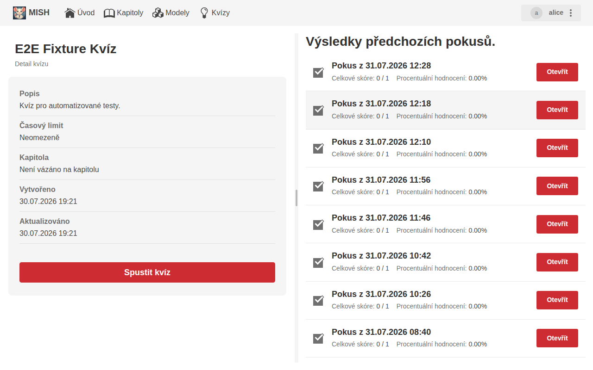
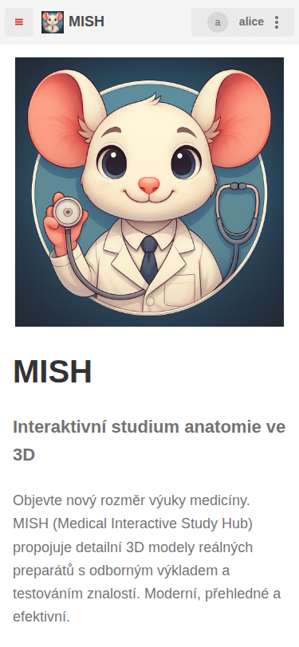
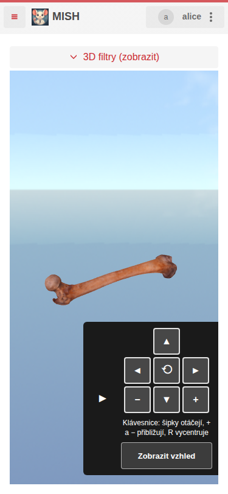
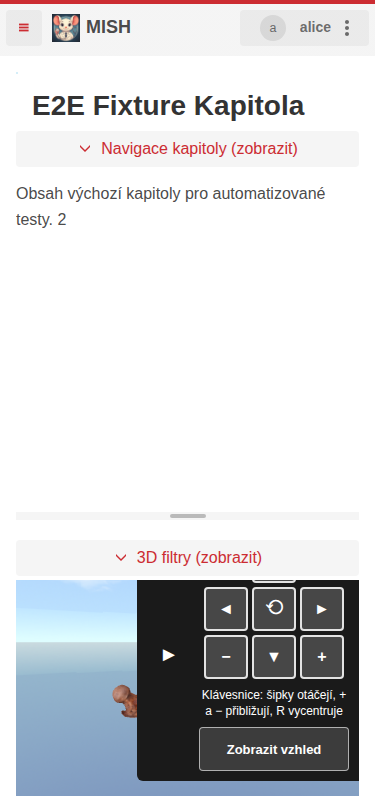
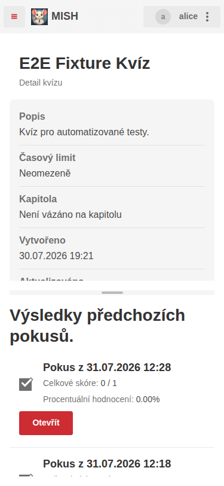

# MISH APP — Frontend


[](https://github.com/zlesak/threejsproofofconcept/actions/workflows/java-tests.yml)
[](https://github.com/zlesak/threejsproofofconcept/actions/workflows/vitest.yml)

## Description

This repository contains the MISH APP application, created as part of a master thesis at the University of Hradec Kralove.
It provides a web-based user interface for interaction with anatomical 3D models, and it contains both the user
interface and the backend in a single deployable application.

The UI is built with the Vaadin framework and Three.js for 3D rendering. The backend stores chapters, quizzes and
uploaded model files in MongoDB (with GridFS for the binaries) and authenticates users against Keycloak.

The backend logic was originally a separate service (https://github.com/Foglas/mishprototype) deployed together with
the UI by a separate set of scripts (https://github.com/zlesak/MISH_SCRIPTS). Both have been folded into this
repository; see [docs/backend-migration.md](docs/backend-migration.md) for how and why.

## Running the application

Everything needed to run the application — database, identity provider and gateway — is in the `infra` directory:

```bash
cd infra && cp .env.example .env && docker compose up -d --build
```

Then open <https://localhost> and log in as `alice` / `password` (teacher) or `bart` / `password` (student).
See [infra/README.md](infra/README.md) for configuration, the `mish` hostname used by the tests, and TLS certificates.
For production deployment, secrets and running on a Raspberry Pi, see [docs/deployment.md](docs/deployment.md).

## Screenshots

### Desktop









### Mobile

| Main page | 3D Model viewer | Chapter detail | Quiz detail |
|-----------|-----------------|----------------|-------------|
|  |  |  |  |

## Testing

### JS and TS app part tests (Vitest)

```bash
npm run test
```

### E2E tests (Playwright)

```bash
npx playwright test
```

### Three.js canvas performance tests

```bash
npx playwright test e2e/threejs-canvas-perf.spec.ts
```

Results are written to `test-results/threejs-perf-results.json` after each run.

### Usability walkthrough

```bash
npx playwright test e2e/usability.spec.ts
```

Measures how long each user task takes and how many interactions it costs; the report lands in
`test-results/usability-report.md`. See [docs/user-testing-plan.md](docs/user-testing-plan.md).

### Java unit and component tests (Maven)

```bash
./mvnw test
```

## Project structure

```
src/
├── main/
│   ├── java/cz/uhk/zlesak/threejslearningapp/
│   │   ├── api/                      # Boundary between the UI and the backend
│   │   │   └── contracts/            # Interfaces the UI depends on
│   │   ├── backend/                  # Backend
│   │   │   ├── persistence/          # MongoDB repositories, queries and GridFS storage
│   │   │   ├── service/              # Chapter, model, file, quiz and grading services
│   │   │   └── web/                  # Model file download endpoint used by the 3D viewer
│   │   ├── common/                   # Shared utilities
│   │   ├── components/               # Reusable Vaadin UI components
│   │   │   ├── buttons/              # Action buttons
│   │   │   ├── commonComponents/     # Shared commmon components
│   │   │   ├── containers/           # Composite layout containers (model, quiz, chapter, upload, …)
│   │   │   ├── dialogs/              # Confirmation and entity-list dialogs
│   │   │   ├── editors/              # Text (editor.js) and quiz question editors
│   │   │   ├── forms/                # Form components for create/edit flows
│   │   │   ├── inputs/               # Selects, file inputs, filters and text fields
│   │   │   ├── listItems/            # Entity card/list-item components for chapters, models and quizzes
│   │   │   ├── notifications/        # Toast notifications (success, error, warning, info, cookies)
│   │   │   ├── quizComponents/       # Quiz renderers and question-type UI components
│   │   │   └── scrollers/            # Scrollable wrappers
│   │   ├── controllers/              # View controllers (logout)
│   │   ├── domain/                   # Domain model
│   │   │   ├── common/               # Shared interfaces and base types
│   │   │   ├── chapter/              # Chapter and sub-chapter entities and filters
│   │   │   ├── documentation/        # Documentation entry entities and index
│   │   │   ├── model/                # 3D model entities and value objects
│   │   │   ├── parsers/              # Data parsers (model listing, texture listing)
│   │   │   ├── quiz/                 # Quiz, question and answer entities
│   │   │   └── texture/              # Texture and area value objects
│   │   ├── events/                   # Application events
│   │   │   ├── chapter/              # Chapter selection events
│   │   │   ├── file/                 # File upload/remove events
│   │   │   ├── model/                # Model selection events
│   │   │   ├── quiz/                 # Quiz and answer events
│   │   │   └── threejs/              # Three.js action events (show, remove, switch texture, …)
│   │   ├── exceptions/               # Custom exception classes
│   │   ├── i18n/                     # Internationalisation (CustomI18NProvider, I18nAware interface)
│   │   ├── security/                 # Security configuration
│   │   ├── services/                 # Domain services (chapter, model, quiz, quiz result, documentation)
│   │   └── views/                    # Vaadin views
│   │       ├── abstractViews/        # Abstract base views (listing, entity, chapter, model, quiz)
│   │       ├── administration/       # Administration centre view
│   │       ├── chapter/              # Chapter detail and create/edit views
│   │       ├── documentation/        # Documentation view
│   │       ├── error/                # Error pages
│   │       ├── model/                # 3D model viewer and create/edit views
│   │       └── quizes/               # Quiz list, detail, play and result views
│   ├── frontend/
│   │   ├── js/
│   │   │   ├── editorjs/             # Editor.js integration
│   │   │   └── threejs/              # Three.js integration
│   │   ├── themes/                   # CSS themes and styles
│   │   └── types/                    # TypeScript type definitions for JS libraries
│   ├── resources/                    # Spring application configuration, doc and i18n text files
│   └── webapp/                       # Static web assets
└── test/
    ├── java/                         # JUnit / Karibu / Spring tests
    └── resources/                    # Test fixtures and configuration
e2e/                                  # Playwright E2E and performance tests
```

